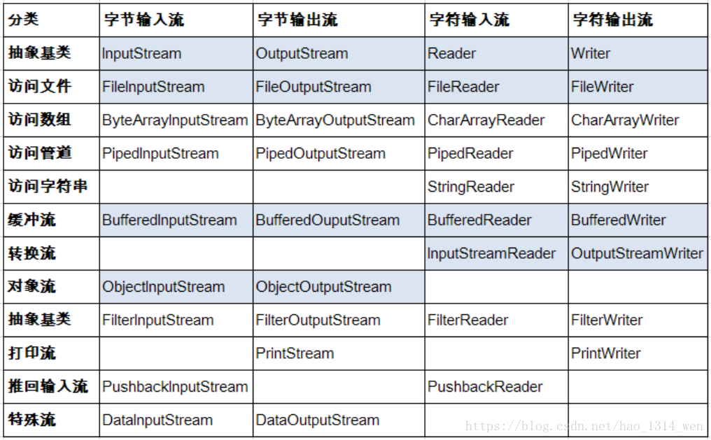

## 流的分类
- 按操作数据单位不同分为：**字节流（8 bit）**，**字符流（16 bit）**
    - 一般字节流用在传输图片视频等非文本文件，字符流一般用在传输 .txt或 .md 等文本文件。
  
- 按数据流的流向不同分为：**输入流**，**输出流**
    - 输入，一般是指站在内存的角度来看（程序的角度），譬如将网络中或磁盘中的数据或文件流进内存（程序）中，这就是**输入流**。  
    - 输出，一般是指将内存（程序）中的数据或文件输出到另一个储存数据的地方，叫做**输出流**。
  
- 按流的角色不同分为：**字节流**、**处理流**
  - 节点流：可以从或向一个特定的地方（节点）读写数据。  
  - 处理流：是对一个已存在的流的连接和封装（对节点流的封装），通过所封装的流的功能调用实现数据读写。
 
 
 
 

## 抽象基类
            字节流         字符流
    输入流  InputStream     Reader
    输出流  OutputStream    Writer

1. Java的IO流涉及40多个类，实际上非常规则，都是从以上四个抽象类派生的。
2. 由这四个类派生出来的子类名称都是以其父类名作为子类名后缀。

